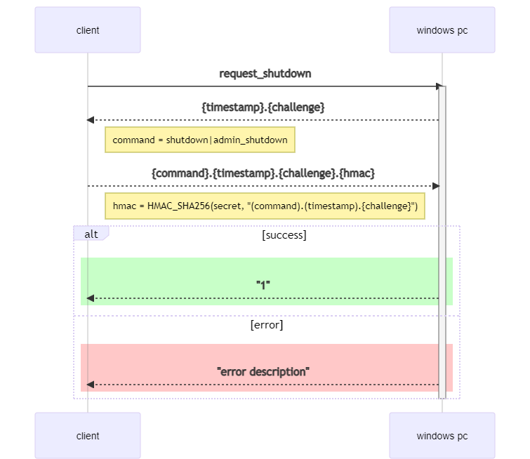

# Remote Shutdown

Allows easy shutdown of a windows pc via network.

The programs runs as a windows service and opens the TCP port 10102.

**[Download](https://github.com/tripplet/remote-shutdown/releases)**

## Features

- Less then 1MB memory usage
- No need to store windows credentials on external systems
- Secure and simple challenge response protocol
- Command exchange can easily be implemented in almost any programming language (even on and ESP8266)
- The generated key is stored securely using [Protected Storage](https://docs.microsoft.com/en-us/windows/win32/devnotes/pstore).
- The generated key cannot be retrieved again, only reset.
  Access to the protected storage would only possible for Administrator users.


## Existing clients

- [Python](clients/python)
- [Go](clients/go)
- [Home Assistant](custom_components/remote_shutdown)
  Easy usage via [HACS](https://hacs.xyz/) by adding

  `https://github.com/tripplet/remote-shutdown` to the a user defined repositories.

## Limitations / TODOs

- Only one active TCP connection can be handled.

## Generating/Retrieving the secret

The following command will generate a new secret and print it once.
If the command is executed a second time a new secret will be set.

    "C:\Program Files\RemoteShutdown\RemoteShutdown.exe" -t

This assumes RemoteShutdown was installed using the msi and the service is running.


## Details

There are currently two commands:

- shutdown: This will only shutdown the PC if there is no active UI session.
  A locked screen also counts as an active session.
  Only if no user is logged on this command will shutdown the PC.
- admin_shutdown: This will always shutdown the pc regardless of any active UI session.

The use is given a message from windows that the shutdown will be performed in 1 minute.
This allows the user to cancel the shutdown with the normal windows command: `shutdown /a`.


### Detailed protocol example (python)

The complete code can be found [here](clients/python).
All commands must be terminated with the line break \n.
The client has a window of 5 seconds to send a valid response.

1. The client opens a TCP connection to the windows PC on port 10102.

    ```python
    conn = socket.socket(socket.AF_INET, socket.SOCK_STREAM)
    conn.connect(('windows pc', 10102))
    ```

2. The client sends the ASCII text "request_challenge".

    ```python
    conn.send(b'request_challange\n')
    ```

3. The windows pc response with a UTC timestamp and a challenge.
   The timestamp encodes the expiration of the challenge is is set to 5 seconds.
   Example: `12345678.RANDOM_LONG_HEX_STRING`

4. The client receives the challenge and calculates the response with the shared secret.

    ```python
    challenge = conn.recv(2048).decode('ascii').strip()

    cmd = 'admin_shutdown'
    message = f'{cmd}.{challenge}'.encode('ascii')
    mac = hmac.new(secret.encode('ascii'), message, hashlib.sha256)
    ```

5. The client sends the response with the hex encoded HMAC.

    ```python
    conn.send((f'{cmd}.{challenge}.{mac.hexdigest()}\n').encode('ascii'))
    ```

6. The windows pc response with the ascii number "1" if the shutdown will be performed.
   Any other response indicates an error.
   Be aware that the shutdown can still be canceled by the user.


### Sequence diagram




### Example exchange

The secret used in the example below is: test

    client <=> windows_pc
     => request_challenge
    <=  1619638694.7dc4b36ec0a0bd4d7f71edaa6d87879b62ba4f9cc7ac846d2618a8ed4231097f
     => shutdown.1619638694.7dc4b36ec0a0bd4d7f71edaa6d87879b62ba4f9cc7ac846d2618a8ed4231097f.eff9e46c45741c2efd581ce86b94cb1665cf298f61c55343d28b496b8cd74de9
    <=  Error: active user logged in
